# Digital Ocean App Platform Guide

In this guide we are going to create a basic Go application that will serve "Hello World" over http. We are going to deploy the application to the Digital Ocean App Platform using our Github repository as the source. After deployment we will verify that the application is running and then proceed to cleanup.

## Setup Github Repository

We need a github repository that we can use to deploy the application. Let's name it "hello-go", for example:

https://github.com/mpetason/hello-go

Reference the [Github Guide](https://www.digitalocean.com/community/tutorials/how-to-push-an-existing-project-to-github) to create a Git repository and familarize yourself with the initial configuration.

Once created, make a directory on your local machine and cd into it.

```bash
mkdir hello-go
cd hello-go
```

Move to step 2 of the guide and initialize Git within the folder.

```bash
git init
```

Set the remote for the repository so that updates can be pushed to Github. Make sure the USERNAME section contains your username on Github. Ex: (mpetason/hell-go.git)

```bash
git remote add origin git@github.com:USERNAME/hello-go.git
```

## Create Go Application

Start out by creating a main.go file that will contain our Go application. We'll use vi to open a file and create it. You can use any text editor you are comfortable with.

```bash
vi main.go
```

The main.go file will contain the information below. Copy/paste the code and save. 

```go
package main

import (
        "fmt"
        "net/http"
)

func main() {
        http.HandleFunc("/", HelloServer)
        http.ListenAndServe(":8080", nil)
}

func HelloServer(w http.ResponseWriter, r *http.Request) {
        fmt.Fprintf(w, "Hello World!")
}
```

The application will listen on port 8080, which will be relevant during the App Platform configuration. To use the App Platform there are [requirements](https://docs.digitalocean.com/products/app-platform/build-system/cloud-native-buildpacks/golang/). We need to run `go mod init` to create a `go.mod` file:

```bash
go mod init USERNAME/hello-go
```

For Example: 

```bash
go mod init mpetason/hello-go
```

At this point there will be two files in your local folder: `main.go` and `go.mod`

The files need to be added to the remote Github repository so that the App Platform can use them for deployment. 

```bash
git add -A
git commit -m 'Added my project'
git push -u -f origin master
```

## Create App Platform app

Now it is time to create the application. Start out by selecting Apps under Manage in the DigitalOcean UI. 

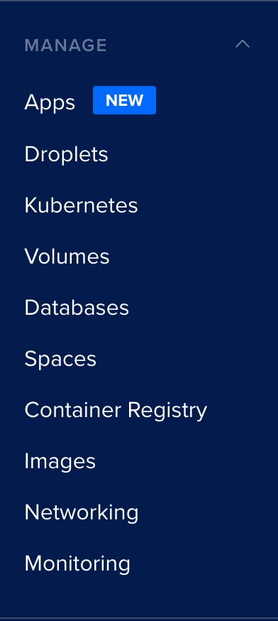

Select Launch Your App. This will take us to the application setup. After we've created an application we'll see an overview of Apps here.

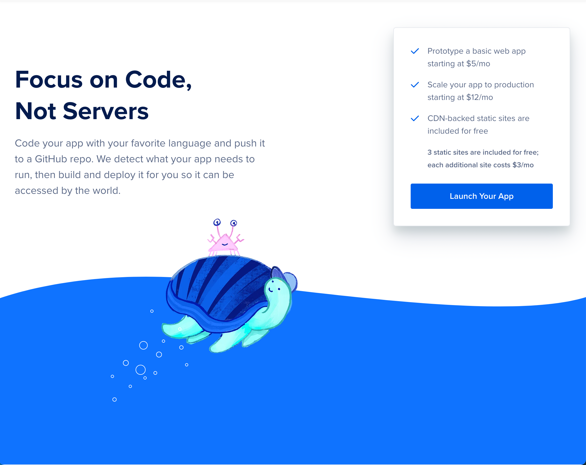


For this guide we're going to be using Github. Select Github and proceed to authorization for DigitalOcean.

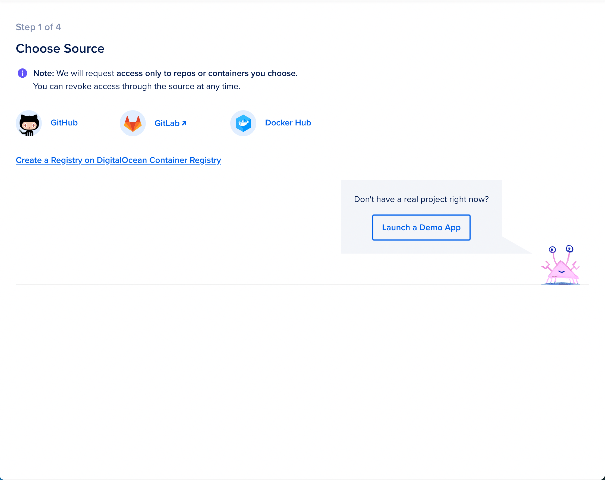


Here we'll install and authorize DigitalOcean so that it can access our Github repository. 

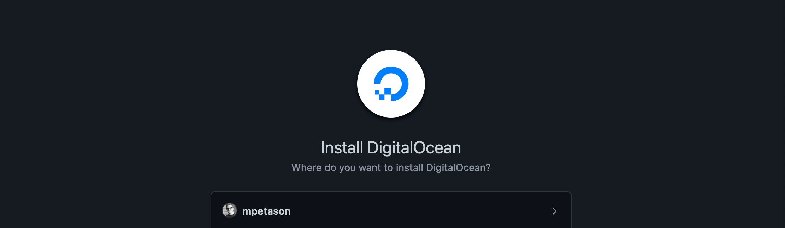


Here we select "Only select Repositories" so we can limit access to the project we're working on.

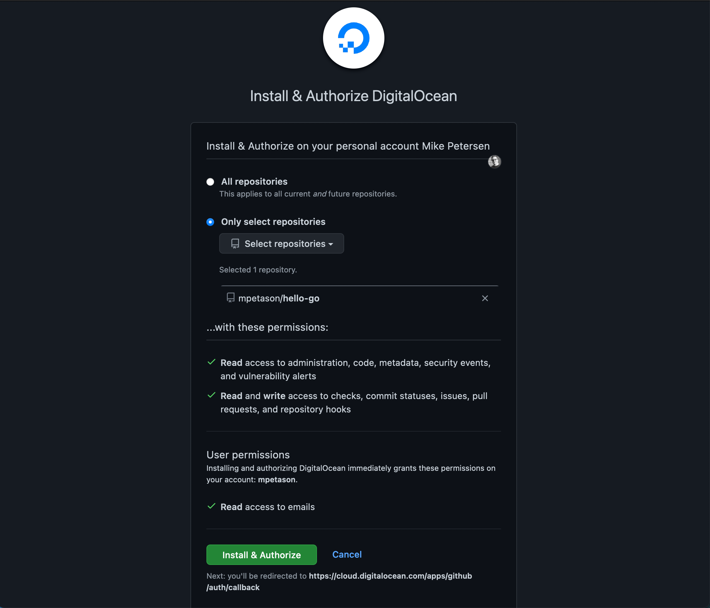


Once we have setup permissions we can now select the repository that we configured as well as the branch. For this guide we'll use the main branch. We'll leave autodeploy code changes in case you want to do further testing before cleanup.

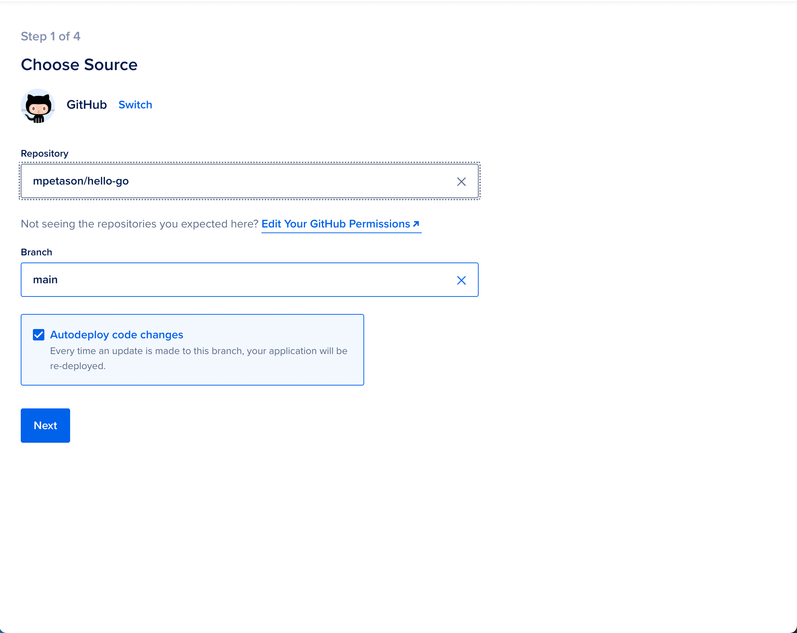


The type that will be used is Web Service. This will build an image and deploy it for us. The HTTP port is 8080 which corresponds to the port we are listening on within the Go applicaiton. Select next to move on to naming the site.

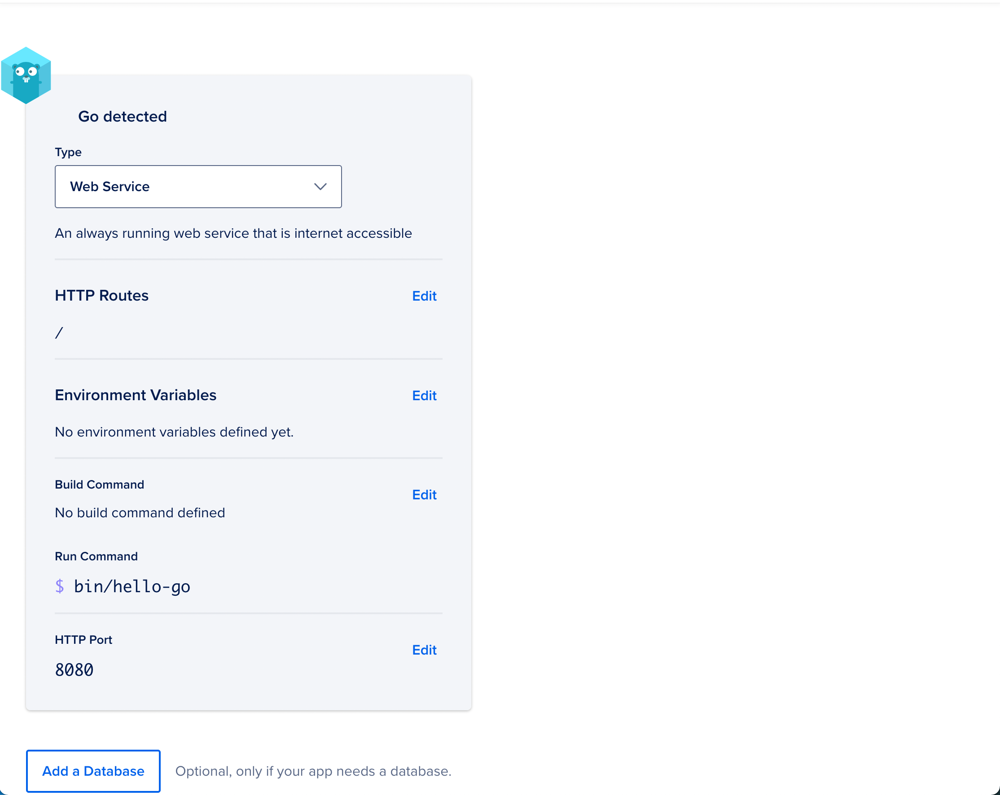


We can use the defaults - hello-go. This will create a URL for us after the application has been deployed.

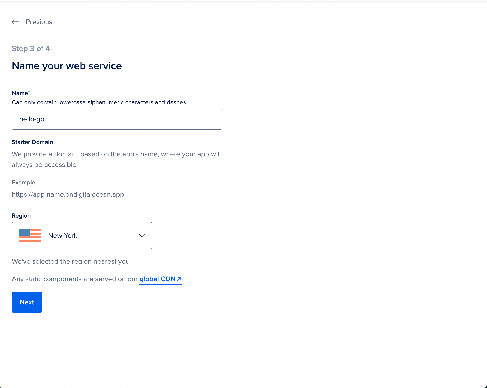


This section allows us to specify what kind of container we want to use. Since we're building an image we need to use Basic. The container size can be changed to the smallest size since we're running a small appliation. Select the $5 a month 512 MB Ram | 1 vCPU option. We'll leave the default 1 container option set to 1. Select Launch Basic App.

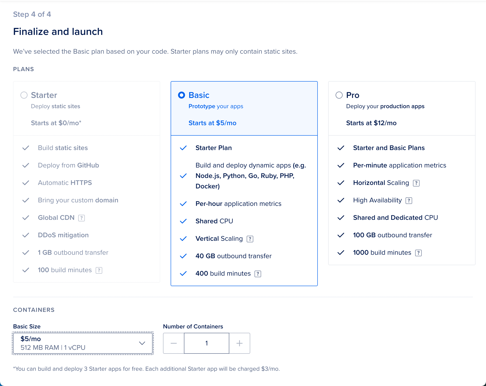


At this point the applcation is being built and deployed. Wait for the application to finish deployment. The screen will update and look similar to the image below.

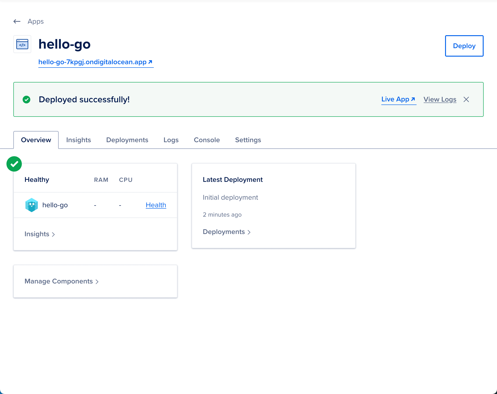


Now that the application has been deployed we can navigate to the website to verify that it works. Click the URL which will open a new tab/window. You should see "Hello World!" show up in the browser.


## Cleanup

Now that we have learned how to deploy the application we'll need to clean it up. Select the Settings tab. 

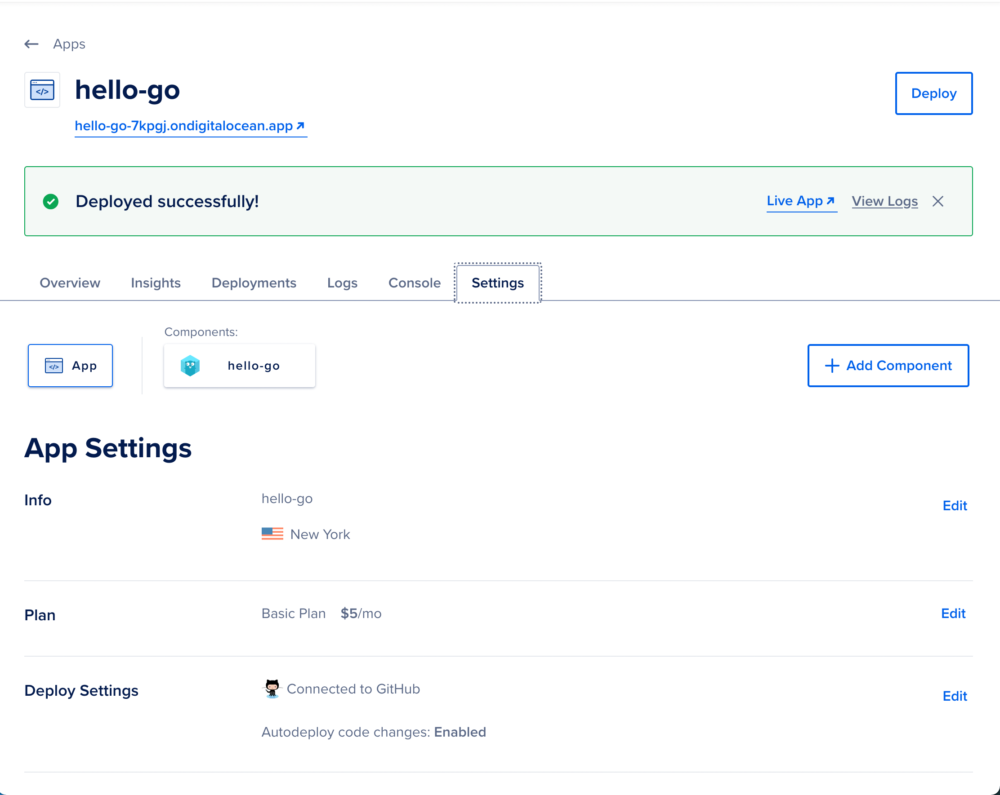


Within settings you'll see a lot of useful information related to the application. We are going to scroll to the bottom and select "Destroy" on the bottom right.

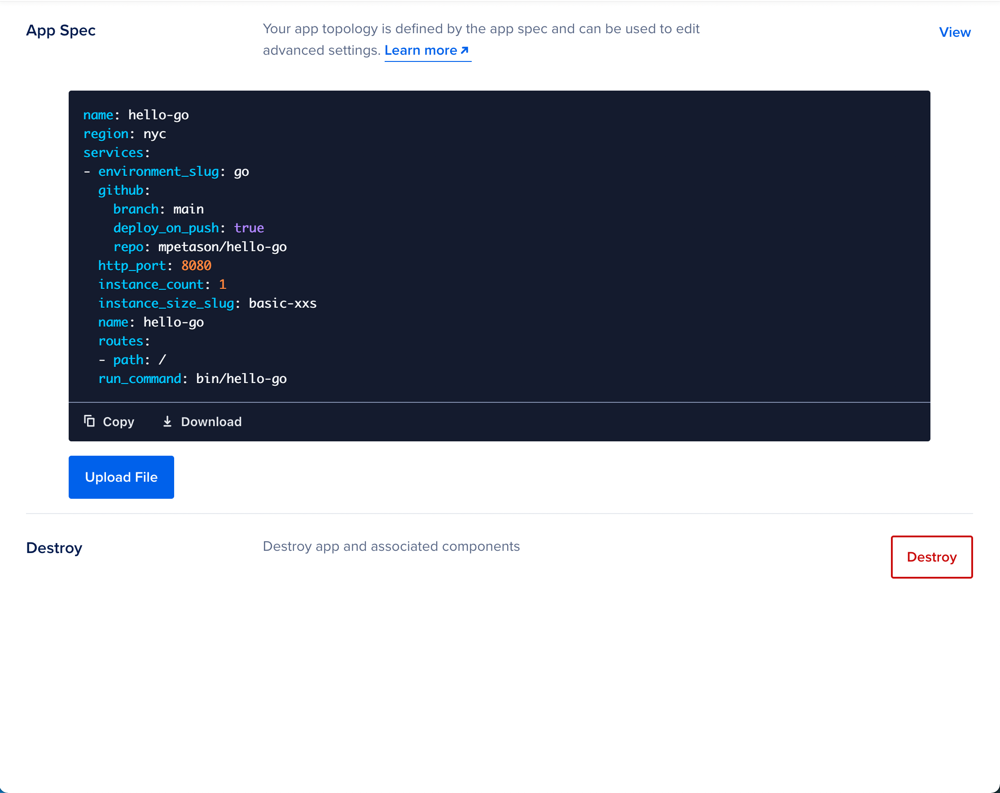


The destroy option verifies that we are ready to destroy by requiring that you type out the application name. Type out the name and select "destroy." 

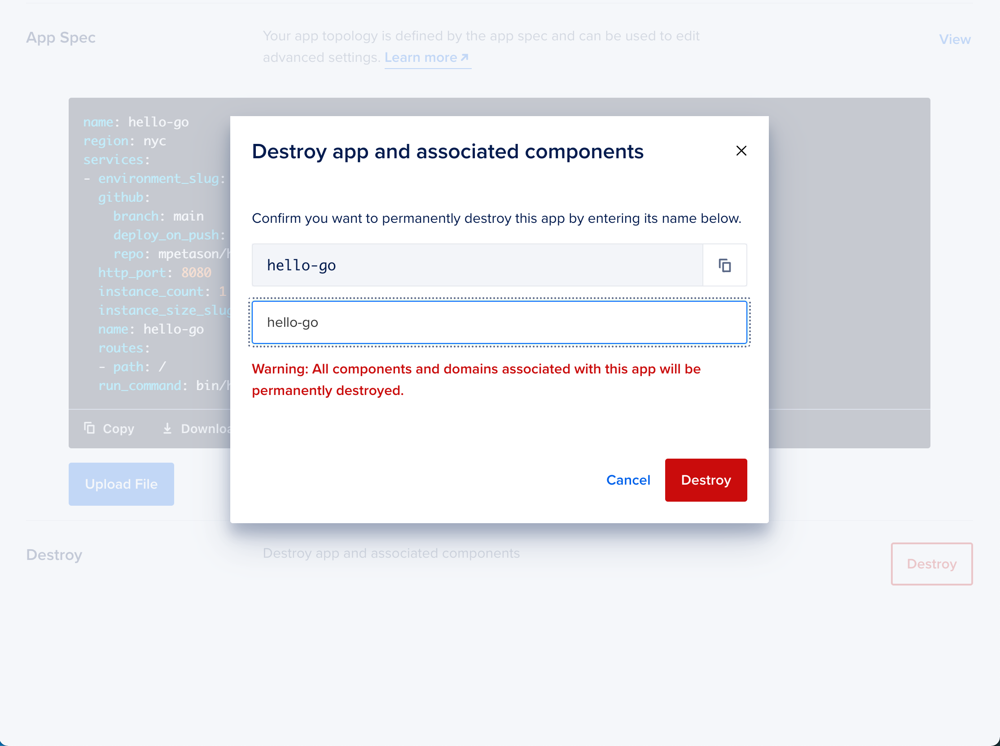


Congratulations, you have created a basic web application, a github repository, and deployed the application using DigitalOcean's App Platform.