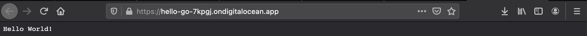

# Digital Ocean App Platform Guide

In this guide we are going to create a basic Go application that will serve "Hello World" over http. We are going to deploy the application to the Digital Ocean App Platform using our Github repository as the source. After deployment we will verify that the application is running and then proceed to cleanup.

## Setup Github Repository

We need a github repository that we can use to deploy the application. Let's name it "hello-go", for example:

https://github.com/mpetason/hello-go

Reference the [Github Guide](https://www.digitalocean.com/community/tutorials/how-to-push-an-existing-project-to-github) to create a Git repository and familarize yourself with the initial configuration.

Once created, make a directory on your local machine and cd into it.

```bash
mkdir hello-go
cd hello-go
```

Move to step 2 of the guide and initialize Git within the folder.

```bash
git init
```

Set the remote for the repository so that updates can be pushed to Github. Make sure the USERNAME section contains your username on Github. Ex: (mpetason/hell-go.git)

```bash
git remote add origin git@github.com:USERNAME/hello-go.git
```

## Create Go Application

Start out by creating a main.go file that will contain our Go application. We'll use vi to open a file and create it. You can use any text editor you are comfortable with.

```bash
vi main.go
```

The main.go file will contain the information below. Copy/paste the code and save. 

```go
package main

import (
        "fmt"
        "net/http"
)

func main() {
        http.HandleFunc("/", HelloServer)
        http.ListenAndServe(":8080", nil)
}

func HelloServer(w http.ResponseWriter, r *http.Request) {
        fmt.Fprintf(w, "Hello World!")
}
```

The application will listen on port 8080, which will be relevant during the App Platform configuration. To use the App Platform there are [requirements](https://docs.digitalocean.com/products/app-platform/build-system/cloud-native-buildpacks/golang/). We need to run `go mod init` to create a `go.mod` file:

```bash
go mod init USERNAME/hello-go
```

For Example: 

```bash
go mod init mpetason/hello-go
```

At this point there will be two files in your local folder: `main.go` and `go.mod`

The files need to be added to the remote Github repository so that the App Platform can use them for deployment. 

```bash
git add -A
git commit -m 'Added my project'
git push -u -f origin master
```

## Create App Platform app

Create App 


Select Github - Install Digital Ocean in your user space


Authorize Github


Choose Repository and branch


App Setup


Name the site


Select Starter > Launch Starter App


Success!




We can also curl

```bash
$ curl https://hello-go-7kpgj.ondigitalocean.app/
Hello World!
```

## Cleanup


